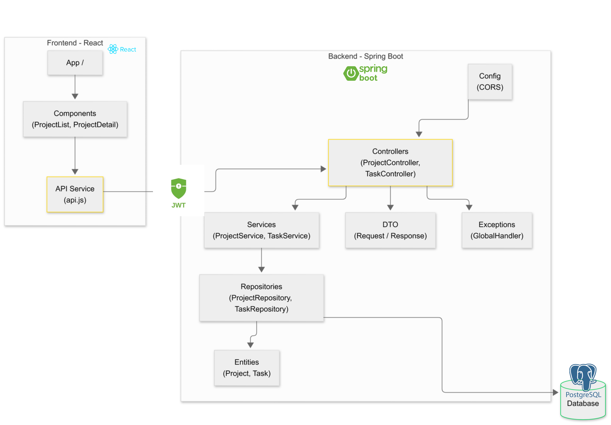
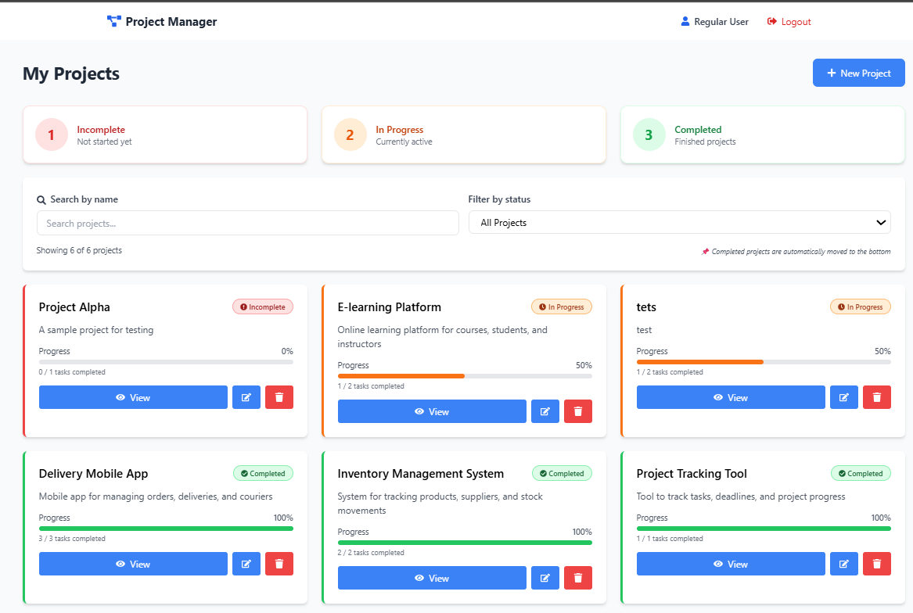

# Project Task Manager - Full Stack Application

##  Description
Full-stack project and task management application developed with Spring Boot and React.

##  Table of Contents
- [Technologies Used](#-technologies-used)
- [Project Architecture](#-project-architecture)
- [Installation and Setup](#-installation-and-setup)
- [API Endpoints](#-api-endpoints)
- [Request Examples](#-request-examples)
- [Features](#-features)
- [Technical Features](#-technical-features)
- [Developer](#-developer)

## Class Diagram


##  Technologies Used
### Backend
- **Java 17**
- **Spring Boot 3.2.0**
- **Spring Data JPA**
- **PostgreSQL** (Database)
- **Maven** (Dependency Manager)
- **Lombok** (Boilerplate Reduction)

### Frontend
- **React 18.2**
- **React Router DOM** (Navigation)
- **Axios** (HTTP Requests)
- **Tailwind CSS** (Styling)
- **React Icons** (Icons)
- **React Toastify** (Notifications)

##  Project Architecture  



##  Installation and Setup

### Prerequisites
- Java 17 or higher
- Maven 3.6+
- Node.js 16+ and npm
- PostgreSQL 13+

### 1. Database Configuration

Run the compose.yaml file in this directory to set up PostgreSQL in Docker:
```bash
docker compose up -d
```

### 2. Backend (Spring Boot)

```bash
# Navigate to the backend folder
cd backend

# Modify application.properties if necessary
# src/main/resources/application.properties
# Update PostgreSQL connection information

# Compile and run the application
mvn clean install
mvn spring-boot:run

# Backend starts on http://localhost:8085
```

**PostgreSQL Configuration in application.properties :**
```properties
spring.jpa.properties.hibernate.dialect = org.hibernate.dialect.PostgreSQLDialect
spring.jpa.hibernate.ddl-auto=update
spring.jpa.hibernate.show-sql=true
spring.datasource.url= ${DB_URL:jdbc:postgresql://localhost:5432/projects_db}
spring.datasource.username=admin
spring.datasource.password=1234
```

### 3. Frontend (React)

```bash
# Navigate to the frontend folder
cd frontend

# Install dependencies
npm install

# Initialize Tailwind CSS
npx tailwindcss init

# Start the application
npm start

# Frontend starts on http://localhost:3000
```

##  API Endpoints

### Projects

| Method | Endpoint | Description |
|--------|----------|-------------|
| GET | `/api/projects` | List all projects |
| GET | `/api/projects/{id}` | Project details |
| POST | `/api/projects` | Create a project |
| PUT | `/api/projects/{id}` | Update a project |
| DELETE | `/api/projects/{id}` | Delete a project |
| GET | `/api/projects/{id}/progress` | Project progress |

### Tasks

| Method | Endpoint | Description |
|--------|----------|-------------|
| GET | `/api/tasks/project/{projectId}` | Project tasks |
| GET | `/api/tasks/{id}` | Task details |
| POST | `/api/tasks` | Create a task |
| PUT | `/api/tasks/{id}` | Update a task |
| PATCH | `/api/tasks/{id}/toggle` | Toggle task status |
| DELETE | `/api/tasks/{id}` | Delete a task |

##  Request Examples

### Create a Project
```json
POST /api/projects
{
  "title": "My New Project",
  "description": "Project description"
}
```

### Create a Task
```json
POST /api/tasks
{
  "title": "Implement Feature X",
  "description": "Detailed description",
  "dueDate": "2025-12-31",
  "projectId": 1
}
```

##  Features

- ✅ Create, read, update, and delete projects
- ✅ Create, read, update, and delete tasks
- ✅ Mark tasks as completed
- ✅ Progress bar per project
- ✅ Automatic progress percentage calculation
- ✅ Responsive user interface
- ✅ Toast notifications
- ✅ Error handling
- ✅ Data validation

##  Technical Features

### Backend
- Layered architecture (Controller, Service, Repository)
- Input validation with Bean Validation
- Global exception handling
- JPA relationships (OneToMany, ManyToOne)
- Automatic timestamps
- CORS configuration

### Frontend
- Functional React components with Hooks
- Routing with React Router
- Local state management with useState
- API calls with Axios
- Responsive design with Tailwind CSS
- Modal forms

##  Developer
Project created for end-of-studies internship - Hahn Software Morocco 2026
